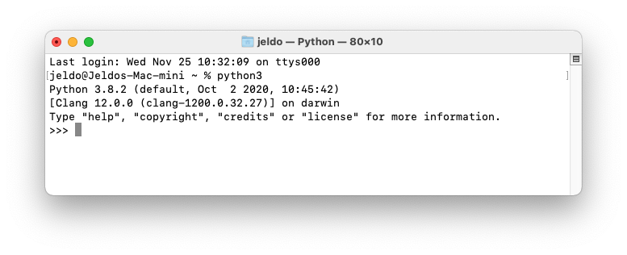

<!-- Global style -->
<style>
section {
  font-size: 18pt;
}
</style>


# Algorithmische Methoden 01: Einführung
**Dr. Sven Naumann**
WS 20/21

---

<!-- header: 1 __Fragen der Organisation__ -->
## 1 Fragen der Organisation
### Veranstaltungsplan 2020

04.11.20 - Einführung

11.11.20 - Elementare Datentypen

18.11.20 - Textverarbeitung

25.11.20 - Kontrollstrukturen und Funktionen

02.12.20 - Komplexe Datentypen

09.12.20 - POS-Tagging

16.12.20 - Ein- und Ausgabe

23.12.20 - Syntaktische Analyse

---

### Veranstaltungsplan 2021


06.01.21 - Komplexe Funktionen

13.01.21 - Objektorientierte Programmierung in Python

20.01.21 - Debugging

27.01.21 - Bibliotheken für Projekte in der Computerlinguistik und Künstlichen Intelligenz

03.02.21 - Datenvisualisierung

10.02.21 - Klausur

---

### Aufgaben

- Sie erhalten regelmäßig _Aufgabenblätter_, für deren Bearbeitung Sie (nach Absprache) 1 oder 2 Wochen Zeit haben.
- Die Aufgabenblätter werden wie die Folien zur Veranstaltung als PDF-Dateien auf _Moodle_ zur Verfügung gestellt.
- Ihre Lösungen schicken Sie bitte per Email an: **svennaumann@uni-trier.de**
- Um zur Abschlussklausur zugelassen werden zu können, müssen Sie mindestens 50% der durch die Aufgabenblätter erreichbaren Punkte erhalten haben.
- Musterlösungen für die Aufgabe werden in der Übung nach der Abgabe der Lösungen besprochen.

### Klausur

- Die Abschlussklausur findet nach der aktuellen Planung in der letzten Vorlesungswoche statt.
- Aktuell handelt es sich um eine Präsenzklausur.
- Vergessen Sie bitte nicht, sich **rechtzeitig** auf PORTA für die Klausur anzumelden!

---

<!-- header: 2 __Warum Programmieren?__ -->
## 2 Warum Programmieren?

- Wenn Sie in einer Suchmaschine die Anfrage _warum programmieren_ eingeben, erhalten Sie viele Links auf Seiten, die Ihnen "gute" Gründe nennen, warum Sie programmieren lernen sollten:
    - Super einfach!
    -  Geld verdienen
    - Computer verstehen
    - Karriere machen
    - Visionen umsetzen
- Es mag vielleicht zynisch klingen, aber meiner Auffassung nach sind die meisten dieser _Gründe_ nicht ganz zutreffend: Für die meisten Menschen ist der Einstieg ins Programmieren **_nicht_** super einfach. Ein Problem so zu beschreiben und sukzessive in Teilprobleme zu zerlegen, dass es sich in ein ausführbares Programm übersetzen lässt, ist für viele zunächst ungewohnt und erfordert Zeit und Geduld.
- Und als Programmierer(in) viel Geld zu verdienen und Karriere zu machen ist auch nicht ganz einfach.

---

- Die Erstellung von Computerprogrammen kann als eine handwerkliche oder vielleicht auch ingenieurswissenschaftliche Tätigkeit betrachtet werden.
- Diese Kompetenz ist für viele Tätigkeitsfelder in Wirtschaft sowie Wissenschaft und Forschung von großer Bedeutung.
- Durch den Einsatz von Computerprogrammen ist es möglich
    - große Datenmengen mit Hilfe statistischer Verfahren effizient auszuwerten,
    - Simulationen für komplexe Prozesse zu entwickeln und
    - Systeme zu schaffen, die unseren Alltag / unser Leben angenehmer gestalten.

---

<!-- header: 3 __Warum Python?__ -->
## 3 Warum Python?

- Es gibt zahlreiche Programmiersprachen, die nach verschiedenen Merkmalen kategorisiert werden können. So unterscheidet man z.B. zwischen
    - _imperativen_
    - _funktionalen_
    - _prozeduralen_
    - _deklarativen_ und
    - _objektorientierten_ Programmiersprachen.

- Als _Skriptsprachen_ bezeichnet man Programmiersprachen, die sich zum schnellen Erstellen einfacher Programme eignen und daher auf komplexe Konstrukte verzichten. Charakteristisch für Skriptsprachen ist in der Regel, dass sie interpreterbasiert sind und ohne Kompilierungsschritt direkt ausgeführt werden können.

---

- Die heute bekanntesten Skriptsprachen **_Pearl_** , **_Ruby_** und **_Python_** unterscheiden sich, was den Sprachumfang betrifft, kaum von Programmiersprachen wie **_C, C++, C#, Java_** und sind in vielen Fällen effizient genug, auch für größere Aufgaben eingesetzt zu werden.
- Für _**Python**_ spricht die Anzahl und Qualität der verfügbaren Bibliotheken: Im Bereich der Computerlinguistik und Künstlichen Intelligenz gibt es kaum Aufgabenbereiche, für die nicht diverse Bibliotheken existieren.


---

<!-- header: 4 __Python__ -->
## 4 Python
### Ein paar Fakten...

- **_Python_** ist eine objektorientierte Skriptsprache, die 1991 entwickelt wurde. Ihr Name geht auf die englische Komikergruppe Monty Python zurück.
- Die aktuelle Version trägt die Versionsnummer 3.8 und kann von https://www.python.org bezogen werden. Da es Kompatibilitätsprobleme gibt (eingeschränkte Abwärtskompatibilität), sollte unbedingt eine aktuelle Version installiert sein/werden.
- Die Installation unter Windows, MacOS und Linux ist sehr einfach. Details finden sich auf der Python-Webseite.
- Neben objektorientierter Programmierung unterstützt Python auch aspektorientierte und funktionale Programmierung.

---

### Ein paar Fakten

- Am auffälligsten ist, dass Blöcke nicht durch Klammern, sondern durch Einrückungen gebildet werden.
- Datentypen werden dynamisch verwaltet und müssen nicht vorab explizit deklariert
werden.
- Zu den von Python unterstützten Datenstrukturen gehören Listen, Tupel, Mengen und assoziative Arrays (dictionaries).
- Python ist modular organisiert: Viele Funktionen sind in Bibliotheken/Module ausgelagert.

---

### Informationsquellen

Es gibt unzählige Einführungen in das Programmieren mit _Python_ , so dass es mir schwer fällt, einige hervorzuheben. Zu den Büchern, die ich kenne und zum Teil schätze, gehören

- Barry, Paul (2016). **_Head First Python. A Brain-Friendly Guide._**
    2. Auflage, O’Reilly.
- Matthes, Eric (2016). **_Python Crash Course._**
    No Starch Press.
- Bader, Dan (2017). **_Python Tricks. Praktische Tipps für Fortgeschrittene._**
    dpunkt.verlag.
- Ramalho, Luciano (2015). **_Fluent Python: Clear, Concise, and Effective Programming._**
    O’Reilly.

---

### Informationsquellen

Natürlich ist es heute angesichts der umfangreichen Informationen, die online verfügbar sind, nicht mehr erforderlich, ein Buch zu kaufen.

Wichtige Webressourcen:

- https://www.w3schools.com/python/default.asp
- https://www.python-kurs.eu/kurs.php
- https://www.codecademy.com/learn/learn-python-
- https://www.kaggle.com/learn/python


---

### Eine Frage der Philosophie

- Wie auch andere Skriptsprachen (Perl, Ruby, etc.) ist **_Python_** eine Interpreter-basierte Programmiersprache.
- Daher benötigt man für die Programmentwicklung neben dem Interpreter, der Python-Shell **_IDLE_** und dem Bibliotheken-Verwaltungstool **_pip_** nur noch einen Texteditor; auch wenn das Arbeiten mit einer IDE sich deutlich komfortabler gestaltet.
- Natürlich gibt es eine Reihe von Sinnsprüchen, die den der Sprache zugrundeliegenden Anspruch ins Philosophische überhöhen:
> Beautiful is better than ugly.
Explicit is better than implicit.
Simple is better than complex.
Complex is better than complicated.
Readability counts.

aus _Zen of Python_

---

### IDLE

Auch wenn **IDLE** (**I**ntegrated **D**eve**L**opment **E**nvironment) sich als eine vollständige Entwicklungsumgebung geriert, handelt es sich primär um eine _read-eval-print_-Schleife, die es ermöglicht, einfache Python-Anweisungen direkt auszuführen bzw. zu testen:



---

### Entwicklungsumgebungen
Es gibt zahlreiche Entwicklungsumgebungen (IDEs) für _Python_.
Zu den bekanntesten gehören:

- **Eclipse mit PyDev**
Wer im Java-Kurs diese IDE verwendet hat, kann sie natürlich auch für Python verwenden. Durch PyDev wird sie zu einer vollwertigen Python-IDE.

- **Eric**
Eric ist eine in Python selbst geschriebene IDE, die das QT-Framework nutzt. Sie ist kostenfrei im Netz erhältlich.

- **PyCharm**
Diese IDE stammt wie viele andere von Jetbrains, ist gut strukturiert und einfach zu bedienen.
Es gibt eine kostenfreie einfache Version und eine registrierungspflichtige Vollversion. Die Registrierung ist für Studierende kostenfrei.
Die einfache Version ist auf den PCs im Pool (B329) installiert.

---

### Die Konsole

Natürlich ist es auch möglich, Python direkt von einem Terminal oder einer Konsole zu starten:

    ldvpc77:~ Sven$ _python
    Python 3.7.0 (v3.7.0:1bf9cc5093, Jun 26 2018, 23:26:24)
    [Clang 6.0 (clang-600.0.57)] on darwin
    Type "help", "copyright", "credits" or "license" for more information._
    >>> help
    Type help() for interactive help, or help(object) for help about object.
    >>> help(len)
    Help on built-in function len in module builtins:
    len (obj, /)
    Return the number of items in a container.
    >>> exit()
    ldvpc77:~ Sven$

---

### Veranstaltungsziele

- Die primäre Informationsquelle, der zentrale Gegenstand, mit dem sich die
Computerlinguistik und die sprachorientierte Künstliche Intelligenz auseinandersetzt, sind (natürlichsprachliche) Texte bzw. Sammlungen (Korpora) solcher Texte.
- Der hier verwendete Textbegriff umfasst gesprochene und geschriebene Texte.
- Wir werden in diesem Kurs einerseits die Grundlagen der Programmiersprache Python vermitteln, wie andererseits auf vielen Beispielen zeigen, wie sich mit Hilfe von Python kleine Programme entwickeln lassen, die elementare Aufgaben aus dem Bereich der Computerlinguistik und Künstliche Intelligenz erledigen.
- Dabei werden Sie verschiedene Bibliotheken kennenlernen und wir werden mehrfach das **N**atural **L**anguage **T**ool **K**it `nltk` verwenden, das eine umfassende Sammlung von Python-Programmen zur Sprachverarbeitung bereitstellt.

---

<!-- header: 5 __Softwareinstallation__ -->
## 5 Softwareinstallation
### Python

Die Installation von Python auf einem aktuellen Gerät, d.h. einem Laptop oder PC, der unter Windows, Linux oder MacOS arbeitet, ist völlig unproblematisch:
Auf der Seite https://www.python.org unter dem Menüpunkt Downloads finden sich neben der aktuellen Python-Version (Oktober 2020: 3.9.0) auch nahezu alle älteren Versionen.
Für Windows gibt es vorkonfektionierte Installationsprogramme. Bei Linux und MacOS muss man sich anders behelfen. Für MacOS empfehle ich `homebrew` und `pyenv`.
Gerade für die Entwicklung von Anwendungen im Bereich Machine Learning, Artificial Intelligence, Data Science und Computerlinguistik bietet es sich an, eine Anaconda-Distribution (https://www.anaconda.com) zu verwenden. Diese Distribution enthält bereits viele Bibliotheken (`numpy`, `pandas`, `sci-kit-learn`, etc.), die in diesem Kontext gerne verwendet werden.

---

### Python 2 vs Python 3
#### Beachten Sie bitte:
Wir arbeiten in diesem Kurs mit `python3` (Version >= 3...).
`python2`, das immer noch auf einigen Systemen vorinstalliert ist, ist nicht oder nur eingeschränkt kompatibel mit `python3`.

---

### PyCharm

- Die Entwicklungsumgebung PyCharm wurde von der Firma JetBrains entwickelt:
https://www.jetbrains.com/de-de/pycharm
- Das Programm ist für Windows, Linux und MacOS verfügbar.
- Normalerweise ist die Nutzung dieser Software nicht kostenfrei.
- Aber für Studierende und Lehrende gibt es "free individual licenses for education."

- Dazu ist es erforderlich, sich registrieren zu lassen:
https://account.jetbrains.com/login

- Anschließend kann man für die Dauer des Studiums bzw. der Lehrtätigkeit alle Produkte der Firma kostenfrei für nicht-kommerzielle Zwecke nutzen.

---

### PyCharm

- Die Installation ist denkbar einfach: Es gibt ein einfaches Installationsprogramm und anschließend ist das Programm direkt ausführbar. Bei der ersten Ausführung sollte man ein neues, leeres Projekt mit frei gewähltem Namen anlegen.
- Die auf dem genutzten System verfügbaren Python-Interpreter muss man gegebenenfalls noch mit dem Projekt verknüpfen: Dazu wählt man im Menü 
`PyCharm > Preferences > Project` aus und deklariert dort die verfügbaren Python-Interpreter (über das Zahnrad-Symbol).

---

### NLTK

> `nltk` is a leading platform for building Python programs to work with human language data. It provides easy-to-use interfaces to over 50 corpora and lexical resources such as WordNet, along with a suite of text processing libraries for classification, tokenization, stemming, tagging, parsing, and semantic reasoning, wrappers for industrial-strength NLP libraries, and an active discussion forum.

Obwohl `nltk` mittlerweile schon etwas in die Jahre gekommen ist, bleibt es immer noch eine einzigartige Ressource für die Computerlinguistik.

---

### NLTK über IDLE

Sofern es nicht installiert ist, kann es wie jede andere Python-Bibliothek installiert werden:

IDLE starten (im Terminal `python3`) und

```
>>> pip install nltk # installiert das NLTK-Paket
>>> import nltk # lädt die NLTK-Bibliothek
>>> nltk.download() # startet den Download der NLTK-Daten.
```

eingeben.

---

### NLTK in PyCharm

1. PyCharm starten.
2. `PyCharm > Preferences > Project Interpreter` auswählen und das `nltk`-Package installieren.

Sollte es bei der Installation der NLTK-Daten Probleme geben, einfach eine Konsole öffnen, ein Zielverzeichnis anlegen und mit `python -m nltk.downloader all` das Laden der Daten initialisieren.

Wichtig ist der Hinweis, dass unter Windows die Kombination der 64-bit Version von Python und NLTK abgeraten und die 32-bit Version empfohlen wird.
Unter den NLTK-kompatiblen Python-Versionen werden auf der NLTK-Seite die **Version 3.5 bis 3.8** genannt. 
Bei der Verwendung von **3.9** könnte es punktuell zu Imkompatibilitäten kommen.

Eine wichtige Ressource für das NLTK ist das im Netz verfügbare Buch von Steven Bird,
Ewan Klein und Edward Loper **_Natural Language Processing with Python_**: https://www.nltk.org/book/

**Vorsicht**: Es findet sich im Netz auch die ältere Version des Buchs, die auf Python2 basiert!

---

### NLTK in PyCharm

Nachdem das Package und die Daten installiert wurden, ist es sinnvoll, einige Daten direkt zu laden:

```python
>>> from nltk.book import *
*** Introductory Examples for the NLTK Book ***
Loading text1, ..., text9 and sent1, ..., sent9
Type the name of the text or sentence to view it.
Type: 'texts()' or 'sents()' to list the materials.
text1: Moby Dick by Herman Melville 1851
text2: Sense and Sensibility by Jane Austen 1811
text3: The Book of Genesis
text4: Inaugural Address Corpus
text5: Chat Corpus
text6: Monty Python and the Holy Grail
text7: Wall Street Journal
text8: Personals Corpus
text9: The Man Who Was Thursday by G . K . Chesterton 1908
```

---

<!-- header: 6 __Erste Schritte mit dem NLTK__ -->
## 6 Erste Schritte mit dem NLTK

Formal betrachtet sind die Bezeichner text1, text2, ... Variablen, die zur Verwaltung der Texte verwendet werden. Die Eingabe einer dieser Variablen führt zur Anzeige einer Kurzinformation:

```python
>>> text1
<Text: Moby Dick by Herman Melville 1851>
>>> text2
<Text: Sense and Sensibility by Jane Austen 1811>
```

---

NLTK stellt viele Funktionen für komplexe Auswertungen zur Verfügung. So kann man sich z.B. anzeigen lassen, in welchen Kontexten ein Ausdruck vorkommt. Dazu dient die Methode `.concordance()`, die einen gewählten Ausdruck (Zeichenkette) als Argument erwartet und für ein Dokument die Kontexte anzeigt, in dem er vorkommt:

```python
>>> text1.concordance("monstrous")
Building index...
Displaying 11 of 11 matches:
ong the former , one was of a most monstrous size. ... This came towards us ,
ll over with a heathenish array of monstrous clubs and spears. Some were thick
d as you gazed , and wondered what monstrous cannibal and savage could ever hav
that has survived the flood ; most monstrous and most mountainous! That Himmal
they might scout at Moby Dick as a monstrous fable , or still worse and more de
th of Radney .'" CHAPTER 55 Of the monstrous Pictures of Whales. I shall ere l
[...]
```

Unter Kontext wird hier eine Zeichenkette der Länge 80 verstanden; es werden bis zu 25 Treffer/Vorkommen angezeigt. Beide Werte (Kontextbreite und Zahl der angezeigten Treffer) lassen sich ändern.

---

Natürlich lassen sich auch Ausdrücke anzeigen, die dem gesuchten Wort darin ähneln, dass sie in vielen Fällen in den gleichen Kontexten vorkommen (distributionelle Ähnlichkeit):

```python
>>> text1.similar("monstrous")
mean part maddens doleful gamesome subtly uncommon careful untoward
exasperate loving passing mouldy christian few true mystifying
imperial modifies contemptible
>>> text2.similar("monstrous")
very heartily so exceedingly remarkably as vast a great amazingly
extremely good sweet
```

Umgekehrt kann die Methode `.common_contexts()` für zwei Ausdrücke den Kontext berechnen, in dem beide vorkommen:

```python
>>> text2.common_contexts(["monstrous", "very"])
a_pretty is_pretty am_glad be_glad a_lucky
```

---

Daneben gibt es natürlich auch eine Reihe grundlegender Funktionen, durch die sich z.B. die Länge eines Textes und die Zahl der unterschiedlichen Wörter/Token eines Textes berechnen lassen:

```python
>>> len(text3)
44764
```

Das Buch _Genesis_ umfasst also knapp 45000 Wörter bzw. _Token_.
Texte werden in NLTK meistens als Listen von Zeichenketten repräsentiert, wobei jede
Zeichenkette ein Wort, ein Satz- oder ein(e) Sonderzeichen(folge) repräsentiert:
‘Die Katze maunzte.’ => `['Die', 'Katze', 'maunzte', '.']`

Um das Vokabular eines Textes zu bestimmen, ist es notwendig, mehrfache
Vorkommen eines Tokens zu entfernen. Dazu kann man in Python die Funktion `set()` verwenden:

```python
>>> len(set(text3))
2789
```

---

Die Funktion `set()` entfernt alle Duplikate einer Liste; d.h. wir erhalten so eine Liste aller im Text enthaltenen Token. Mit `sorted()` können wir sie bei Bedarf (aufsteigend) sortieren:

```python
>>> sorted(set(text3))
['!', "'", '(', ')', ',', ',)', '.', '.)', ':', ';', ';)', '?', '?)', 'A', 'Abel',
'Abelmizraim', 'Abidah', 'Abide', 'Abimael', 'Abimelech',
'Abr', 'Abrah', 'Abraham', 'Abram', 'Accad', 'Achbor', 'Adah', ...]
```

Mit `.count()` kann man die Anzahl eines Tokens in einem Text bestimmen:

```python
>>> text1.count("the")
13721
```

---

<!-- header: __Ende__ -->
# Danke
## Damit endet unser 'erster Kontakt' mit NLTK und auch diese erste Sitzung.